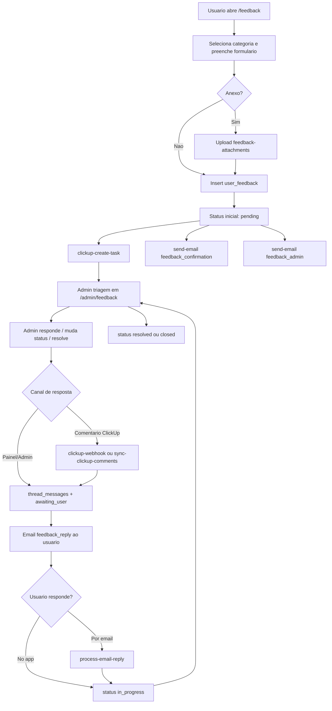
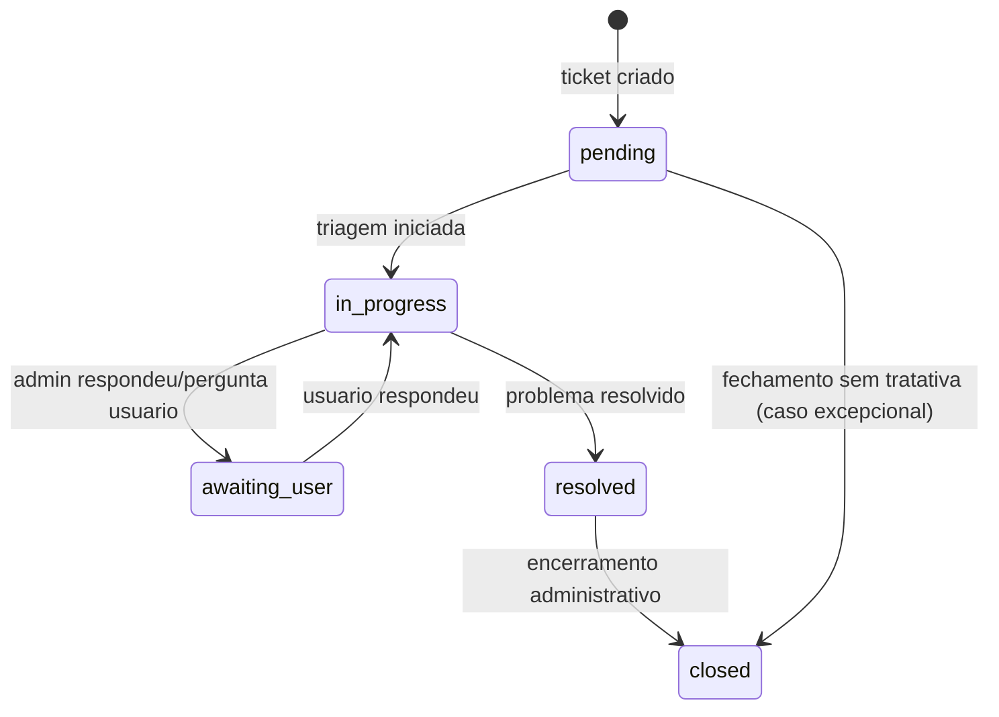

# FLUXO - Mapa operacional da pagina Suporte & Feedback

## 1. Objetivo deste documento

Este documento traduz o funcionamento da pagina **Suporte & Feedback** em **mapa de fluxo operacional**, conectando:

- experiencia do usuario
- operacao do time de suporte
- automacoes com Edge Functions
- integracoes ClickUp/Resend
- estados e transicoes do ticket

Ele complementa:

- `PRD.md` (visao de produto)
- `RUNBOOK.md` (operacao e incidentes)

---

## 2. Como ler este mapa de fluxo

Este mapa foi organizado em 4 camadas:

1. **Camada UX (Usuario)**: o que a pessoa faz no app
2. **Camada Sistema (App + Supabase)**: validacao, persistencia e estado
3. **Camada Operacional (Admin)**: triagem, resposta e resolucao
4. **Camada Integracoes (ClickUp + Email + IA)**: sincronizacao e notificacoes

---

## 3. Atores e responsabilidades

## 3.1 Usuario final

- abre ticket
- acompanha status
- responde no app
- pode responder por email

## 3.2 Sistema frontend (pagina /feedback)

- coleta dados e valida formulario
- faz upload de anexo (opcional)
- cria registro em `user_feedback`
- atualiza lista "Meus Envios"

## 3.3 Operacao admin

- triagem por status/prioridade/categoria
- responde ticket
- altera status/prioridade
- encerra/resolve

## 3.4 Edge Functions

- criam/sincronizam relacao com ClickUp
- enviam emails transacionais
- processam retorno por email
- executam analise IA de apoio tecnico

## 3.5 Sistemas externos

- ClickUp: gestao de task e comentarios
- Resend: entrega e recebimento de email

---

## 4. Mapa macro ponta a ponta



---

## 5. Fluxo detalhado por etapa

## 5.1 Fluxo F1 - Abertura de ticket

### Entrada
- Usuario autenticado acessa `/feedback`.

### Passos
1. Escolhe categoria.
2. Assunto e pre-preenchido (editavel).
3. Preenche descricao.
4. Opcional: adiciona anexo.
5. Clica em "Enviar Feedback".

### Regras
- assunto obrigatorio
- descricao obrigatoria
- anexo max 5MB

### Saida esperada
- novo registro em `user_feedback` com status `pending`
- tentativa de criar task no ClickUp
- disparo de emails de confirmacao e notificacao
- tela `success`

### Desvios
- falha upload: ticket ainda pode ser aberto sem anexo
- falha ClickUp/email: ticket base continua valido no banco

---

## 5.2 Fluxo F2 - Acompanhamento pelo usuario

### Entrada
- Usuario volta para estado de menu em `/feedback`.

### Passos
1. Visualiza bloco "Meus Envios" (ultimos tickets).
2. Abre bottom-sheet do ticket.
3. Consulta:
   - status
   - descricao
   - anexo
   - thread de conversa
   - ultimo retorno admin

### Saida esperada
- usuario entende estado atual sem depender de contato externo

---

## 5.3 Fluxo F3 - Resposta do usuario no app

### Entrada
- Ticket em estado ativo (`pending`, `in_progress`, `awaiting_user`).

### Passos
1. Usuario escreve resposta no campo "Sua Resposta".
2. Sistema adiciona mensagem em `thread_messages` (`from: user`).
3. Atualiza:
   - `last_message_at`
   - `last_message_from = user`
   - `status = in_progress`
4. Opcional: envia comentario para ClickUp via `clickup-reply`.

### Saida esperada
- ticket retorna para fila de analise do suporte

---

## 5.4 Fluxo F4 - Resposta do admin no painel

### Entrada
- Ticket aberto no `/admin/feedback`.

### Passos
1. Admin abre detalhe do ticket.
2. Escreve resposta em ReplyForm.
3. Sistema grava resposta no thread (`from: admin`).
4. Atualiza status para `awaiting_user`.
5. Envia email de resposta ao usuario.

### Saida esperada
- usuario recebe resposta por app + email

---

## 5.5 Fluxo F5 - Resposta vinda do ClickUp

### Entrada
- Comentario novo na task do ClickUp.

### Caminho A (push)
1. ClickUp envia evento para `clickup-webhook`.
2. Funcao identifica `task_id` e comentario.
3. Atualiza `user_feedback` com nova mensagem admin.
4. Atualiza status para `awaiting_user`.
5. Envia email `feedback_reply`.

### Caminho B (pull/manual)
1. Admin aciona "Atualizar" (sync comentarios).
2. `sync-clickup-comments` busca comentarios mais novos.
3. Atualiza ticket e envia email ao usuario.

### Saida esperada
- thread do app sincronizada com conversa operacional no ClickUp

---

## 5.6 Fluxo F6 - Resposta por email do usuario

### Entrada
- Usuario responde email de suporte.

### Passos
1. Resend envia evento inbound.
2. `process-email-reply` recebe payload.
3. Funcao extrai conteudo util da resposta.
4. Identifica ticket por marcador `[#feedback_id]` no assunto (ou fallback por subject).
5. Atualiza thread com mensagem `from: user`.
6. Status volta para `in_progress`.

### Saida esperada
- conversa por email reaparece no app/admin sem perda de contexto

---

## 5.7 Fluxo F7 - Resolucao e encerramento

### Entrada
- suporte conclui tratamento

### Passos
1. Admin marca ticket como `resolved` (ou `closed`).
2. Sistema registra timestamps de resolucao.
3. Usuario visualiza estado final no app.

### Saida esperada
- ciclo de suporte encerrado com rastreabilidade

---

## 6. Mapa de estados do ticket



---

## 7. Matriz evento -> efeito no sistema

| Evento | Origem | Efeito principal | Status resultante |
|---|---|---|---|
| Ticket criado | Usuario | INSERT `user_feedback` + emails + tentativa ClickUp | `pending` |
| Admin inicia triagem | Admin | update status | `in_progress` |
| Admin responde | Admin/ClickUp | append `thread_messages` + email usuario | `awaiting_user` |
| Usuario responde no app | Usuario | append `thread_messages` | `in_progress` |
| Usuario responde por email | Resend inbound | append `thread_messages` | `in_progress` |
| Ticket resolvido | Admin | update status + resolved_at | `resolved` |
| Ticket fechado | Admin | update status | `closed` |

---

## 8. Mapa de falhas (resumo)

## 8.1 Falha de ClickUp
- Nao deve bloquear criacao do ticket base.
- Ticket continua operavel no app/admin.

## 8.2 Falha de email
- Nao deve apagar ou invalidar ticket.
- Operacao segue pelo app/admin.

## 8.3 Falha de sincronizacao comentario
- Mitigar com `sync-clickup-comments` manual.

## 8.4 Falha de parser email inbound
- Validar assunto com marcador `[#id]`.
- Usar fallback por subject apenas como contingencia.

---

## 9. Como a IA do Figma deve construir o mapa em fluxo

## 9.1 Entregavel esperado no Figma

Criar um board com 3 artefatos:

1. **Journey do Usuario**
   - foco em experiencia (abrir, acompanhar, responder)
2. **Service Blueprint Operacional**
   - swimlanes: Usuario | App | Edge Functions | ClickUp | Email | Admin
3. **Mapa de Incidentes**
   - ramificacoes de falha + acao de recuperacao

## 9.2 Convencao visual recomendada

- **Retangulo azul**: acao do usuario
- **Retangulo violeta**: acao de admin
- **Retangulo verde**: persistencia em banco/storage
- **Retangulo laranja**: chamada Edge Function
- **Retangulo cinza**: sistema externo (ClickUp/Resend)
- **Losango amarelo**: decisao
- **Borda vermelha tracejada**: ramo de erro

## 9.3 Prompt sugerido para Figma AI (macro)

```text
Crie um service blueprint mobile-first para a pagina "Suporte & Feedback" de um SaaS.
Use 6 swimlanes: Usuario, Frontend App, Supabase DB/Storage, Edge Functions, ClickUp/Resend, Admin.
Mapeie o fluxo: abrir ticket -> upload opcional -> insert user_feedback(pending) -> clickup-create-task -> send-email(confirmacao/admin) -> triagem admin -> resposta admin(awaiting_user) -> resposta usuario(in_progress) -> resolucao(resolved/closed).
Inclua ramificacoes de erro para falha de ClickUp, falha de email e falha de webhook.
Use cores por tipo de nodo e setas com numeracao de etapa.
```

## 9.4 Prompt sugerido para Figma AI (detalhe suporte)

```text
Crie um mapa operacional de suporte com foco em troubleshooting para tickets.
Mostre eventos de entrada: resposta no app, comentario no ClickUp, resposta por email inbound.
Para cada evento, detalhe: edge function acionada, campos atualizados em user_feedback, status final e notificacao enviada.
Adicione coluna "acao do suporte" para cada falha.
```

## 9.5 Prompt sugerido para Figma AI (modo treinamento)

```text
Gere um fluxograma didatico para onboarding de analistas de suporte.
Objetivo: que um novo agente entenda em 5 minutos como um ticket percorre app, admin, clickup e email.
Incluir legenda, estados do ticket e checklist final "o que validar antes de resolver".
```

## 9.6 Checklist de qualidade do mapa no Figma

O mapa so e considerado pronto se responder claramente:

1. Onde o ticket nasce?
2. Qual status inicial e quando muda?
3. Como respostas entram no thread por cada canal?
4. Qual funcao dispara email para usuario?
5. O que acontece se ClickUp falhar?
6. Como o suporte recupera sincronizacao quebrada?

---

## 10. Mapa em fluxo como novo padrao de sustentacao

Este documento estabelece o conceito de **mapa em fluxo** como camada obrigatoria de entendimento operacional.

Padrao por pagina:

1. `PRD.md` -> o que e por que existe
2. `RUNBOOK.md` -> como operar e recuperar
3. `FLUXO.md` -> como o sistema se movimenta ponta a ponta

---

## 11. Governanca e manutencao

Atualizar este `FLUXO.md` sempre que houver alteracao em:

- estados de status
- regras de transicao
- integracoes externas
- funcoes edge envolvidas
- experiencia de resposta do usuario/admin

Regra pratica:

- mudou fluxo real -> atualiza PRD + RUNBOOK + FLUXO na mesma entrega.
