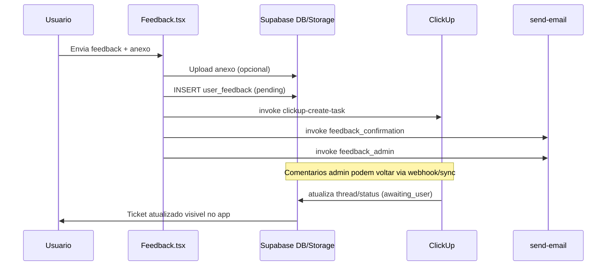

# PRD - Pagina Suporte & Feedback

## 1. Visao geral

A pagina **Suporte & Feedback** e o canal oficial de comunicacao entre usuario final e time do Hub de Produto para:

- reportar bugs
- enviar sugestoes
- tratar temas de assinatura
- acompanhar status do ticket
- manter conversa bidirecional com o suporte

Ela funciona como porta de entrada da operacao de suporte e conecta o frontend do app ao ecossistema operacional:

- banco de dados (`user_feedback`)
- storage de anexos (`feedback-attachments`)
- orquestracao de tickets no ClickUp
- notificacoes por email (Resend via `send-email`)
- analise tecnica assistida por IA (painel admin)

Documentos complementares desta pagina:

- `PRD.md` (produto e requisitos)
- `RUNBOOK.md` (operacao e incidentes)
- `FLUXO.md` (mapa ponta a ponta e transicoes)

---

## 2. Objetivo de produto

### 2.1 Objetivo principal
Criar um fluxo simples para o usuario abrir um ticket e transparente para acompanhar evolucao, reduzindo atrito de suporte e aumentando confianca no produto.

### 2.2 Objetivos secundarios

1. Estruturar feedback para triagem tecnica rapida.
2. Garantir rastreabilidade ponta a ponta (app -> banco -> ClickUp -> resposta -> app/email).
3. Dar base operacional para SLA e melhoria continua.
4. Permitir sustentacao futura por IA com contexto estruturado.

### 2.3 Nao objetivos

- Nao substitui chat em tempo real.
- Nao cobre atendimento comercial geral fora do escopo de ticket.
- Nao implementa workflow BPM completo com filas multi-equipe (ainda).

---

## 3. Escopo funcional atual

## 3.1 Frontend usuario (pagina `/feedback`)

Fonte principal: `src/pages/Feedback.tsx`

### Recursos entregues

1. **Menu de categorias** de suporte com icone e cor.
2. **Formulario de envio** com:
   - assunto
   - descricao
   - anexo opcional (max 5MB)
3. **Upload de anexo** para bucket publico.
4. **Criacao de ticket** na tabela `user_feedback`.
5. **Criacao de task no ClickUp** (best effort, nao bloqueante).
6. **Envio de email**:
   - confirmacao ao usuario
   - notificacao ao admin
7. **Tela de sucesso** apos envio.
8. **Lista "Meus Envios"** (ultimos 10 feedbacks).
9. **Bottom-sheet de detalhe** do ticket com:
   - mensagem original
   - anexo
   - historico de conversa (`thread_messages`)
   - status atual
   - aviso de "aguardando sua resposta"
10. **Resposta do usuario no ticket** diretamente no app.

### Estados de UI

- `menu`: selecao de categoria + meus envios
- `form`: preenchimento do ticket
- `success`: confirmacao de envio
- `selectedFeedback`: abre modal de detalhes/conversa

---

## 3.2 Operacao admin (rota `/admin/feedback`)

Fonte principal: `src/pages/admin/AdminFeedbackPro.tsx`

### Recursos entregues

1. Dashboard de KPI de tickets.
2. Filtros por status, categoria, prioridade, SLA e busca textual.
3. Modos de visualizacao: Lista, Kanban, Analytics.
4. Acoes operacionais:
   - atualizar status
   - atualizar prioridade
   - adicionar notas
   - atribuir responsavel
   - gerenciar tags
   - responder usuario
   - resolver ticket com email
   - deletar ticket
   - analisar ticket com IA
5. Sincronizacao manual de comentarios do ClickUp (`sync-clickup-comments`).

---

## 4. Jornada do usuario (fluxo principal)

## 4.1 Abrir ticket

1. Usuario acessa `/feedback` a partir de `Settings`.
2. Escolhe categoria (ex.: "Reportar Bug").
3. Assunto e pre-preenchido com label da categoria (editavel).
4. Usuario descreve contexto e opcionalmente anexa arquivo.
5. Sistema faz upload do anexo (se houver).
6. Sistema grava ticket em `user_feedback` com status inicial `pending`.
7. Sistema tenta criar task no ClickUp.
8. Sistema envia emails (usuario + admin).
9. Usuario visualiza tela de sucesso e pode enviar outro.

## 4.2 Acompanhar ticket

1. Ticket aparece em "Meus Envios".
2. Usuario abre detalhe no bottom-sheet.
3. Se houver resposta do admin:
   - mensagem aparece em thread
   - status pode ir para `awaiting_user`
4. Usuario responde no campo "Sua Resposta".
5. Status volta para `in_progress`.

## 4.3 Conversa via canais externos

- Admin responde no painel -> sistema envia email para usuario.
- Resposta do usuario por email pode voltar para o ticket via `process-email-reply`.
- Comentario no ClickUp pode sincronizar para thread do app via:
  - `clickup-webhook` (push)
  - `sync-clickup-comments` (pull/manual)

---

## 5. Taxonomia e regras de negocio

## 5.1 Categorias (frontend)

- `sugestao_melhoria`
- `bug_report`
- `assinatura`
- `dados_desaparecidos`
- `sincronizacao`
- `nova_versao`
- `outros_bugs`
- `outro`

## 5.2 Status de ticket

- `pending`
- `in_progress`
- `awaiting_user`
- `resolved`
- `closed`

### Transicoes tipicas

- novo ticket: `pending`
- admin inicia tratativa: `in_progress`
- admin responde pedindo retorno: `awaiting_user`
- usuario responde: `in_progress`
- admin finaliza: `resolved`
- encerramento administrativo: `closed`

## 5.3 Regras de anexo

- tamanho maximo no frontend: 5MB
- bucket: `feedback-attachments`
- mime types permitidos (config SQL): imagens, PDF, TXT, LOG
- naming path: `${user.id}/${timestamp}.${ext}`

---

## 6. Modelo de dados

## 6.1 Tabela principal: `user_feedback`

Baseado em:
- `supabase_user_feedback.sql`
- migrations de workflow e enriquecimento

Campos-chave operacionais:

- identificacao: `id`, `user_id`, `user_email`, `user_name`
- classificacao: `category`, `status`, `priority`, `tags`
- conteudo: `subject`, `description`, `attachment_url`
- colaboracao: `thread_messages`, `last_message_at`, `last_message_from`, `last_admin_reply`
- ClickUp: `clickup_task_id`, `clickup_task_url`, `last_clickup_comment_id`
- IA: `ai_analysis`, `ai_analyzed_at`
- SLA/operacao: `sla_due_at`, `sla_breached`, `first_response_at`, `resolved_at`, `resolution_time_hours`
- auditoria: `created_at`, `updated_at`, `admin_notes`, `assigned_to`, `assigned_at`

## 6.2 Tabela de auditoria

`feedback_activity_log` registra mudancas como:

- criacao
- alteracao de status
- alteracao de prioridade
- atribuicao

## 6.3 Storage

Bucket `feedback-attachments` (publico) para anexos do ticket.

---

## 7. Integracoes e arquitetura de servicos

## 7.1 Edge Functions envolvidas

1. `clickup-create-task`
   - cria task no ClickUp ao abrir ticket
   - escreve `clickup_task_id` e `clickup_task_url` no feedback
2. `clickup-reply`
   - envia resposta do usuario para comentario na task
3. `clickup-webhook`
   - recebe eventos do ClickUp
   - sincroniza comentario admin para thread e status
4. `sync-clickup-comments`
   - sincronizacao manual/periodica de comentarios novos
5. `send-email`
   - templates de notificacao (feedback_confirmation, feedback_admin, feedback_reply)
6. `process-email-reply`
   - ingestao de resposta por email para `thread_messages`
7. `analyze-feedback`
   - analise automatica com IA para apoio tecnico no admin

## 7.2 Sequencia simplificada

---

## 8. Seguranca, permissao e compliance

## 8.1 RLS

- Usuario comum pode inserir e ler apenas seus tickets.
- Master/admin (via `profiles.is_master = true`) pode ler/atualizar/deletar para operacao.
- Politicas RLS foram reforcadas para evitar `USING (true)` em tabelas sensiveis.

## 8.2 Privacidade

- Dados do ticket incluem email e descricao livre (potencial dado sensivel).
- Anexos estao em bucket publico hoje (tradeoff de simplicidade x privacidade).
- Recomenda-se avaliar bucket privado + signed URL para dados sensiveis.

## 8.3 Seguranca operacional

- `send-email` tem rate limit por IP para tipos publicos.
- Tipos de email privilegiados exigem autenticacao e perfil master.
- Edge functions de integracao usam service role para operacao server-side.

---

## 9. UX/UI - avaliacao tecnica da pagina

## 9.1 Pontos fortes

1. **Entrada guiada por categoria** (baixa friccao cognitiva).
2. **Feedback loop claro** (sucesso + status + meus envios).
3. **Thread no proprio app** (nao depende apenas de email).
4. **Bottom-sheet bem ajustado para mobile**.
5. **Visual consistente** com o restante do app.

## 9.2 Pontos de atencao

1. Erros no frontend ainda usam `alert` em alguns pontos (melhor padronizar para toast).
2. Lista "Meus Envios" mostra ate 10 itens (pode limitar historico sem paginacao).
3. `thread_messages` e atualizado como array completo (risco de concorrencia em cenarios de alta simultaneidade).
4. Bucket publico pode nao ser ideal para anexos de incidente com dados pessoais.
5. `clickup-webhook` e `sync-clickup-comments` coexistem; importante definir estrategia oficial para evitar duplicidade de processamento.

---

## 10. Requisitos funcionais (RF)

- RF-01: usuario autenticado deve abrir ticket selecionando categoria.
- RF-02: assunto e descricao obrigatorios para envio.
- RF-03: permitir anexo opcional ate 5MB.
- RF-04: ticket criado deve aparecer imediatamente em "Meus Envios".
- RF-05: sistema deve notificar usuario por email ao criar ticket.
- RF-06: sistema deve notificar admin por email ao criar ticket.
- RF-07: usuario deve visualizar status do ticket no app.
- RF-08: usuario deve responder ticket no app e manter historico.
- RF-09: resposta do admin deve refletir no app e por email.
- RF-10: admin deve ter painel com triagem, filtros e acoes de resolucao.

---

## 11. Requisitos nao funcionais (RNF)

- RNF-01: app mobile-first com navegacao fluida.
- RNF-02: resiliencia a falha em integracoes externas (ClickUp/email nao bloqueia criacao do ticket base).
- RNF-03: rastreabilidade via timestamps e activity log.
- RNF-04: isolamento de dados por usuario (RLS).
- RNF-05: capacidade de observabilidade por logs em edge functions.

---

## 12. Observabilidade e operacao

## 12.1 Logs recomendados

- taxa de criacao de ticket por categoria
- falha de upload de anexo
- falha de `clickup-create-task`
- falha de envio `feedback_confirmation` e `feedback_admin`
- latencia de primeira resposta (`first_response_at - created_at`)
- taxa de tickets em `awaiting_user` > X dias

## 12.2 KPIs operacionais

- volume diario de tickets
- SLA compliance
- tempo medio de primeira resposta
- tempo medio de resolucao
- distribuicao por categoria e prioridade
- reabertura (volta de resolved para in_progress)

---

## 13. Casos de teste (alto nivel)

## 13.1 Fluxo feliz

1. abrir ticket sem anexo
2. abrir ticket com imagem
3. receber email de confirmacao
4. visualizar ticket em "Meus Envios"
5. admin responde e usuario ve thread atualizada
6. usuario responde e status volta para `in_progress`

## 13.2 Borda

1. anexo > 5MB deve ser bloqueado
2. categoria valida + descricao longa
3. ticket sem `clickup_task_url` ainda deve funcionar
4. clickup indisponivel nao deve impedir INSERT no banco

## 13.3 Falha

1. erro no upload do anexo
2. erro no insert de `user_feedback`
3. erro no envio de email
4. webhook com payload inesperado
5. process-email-reply sem `[#id]` no assunto

---

## 14. Roadmap sugerido (priorizado)

## P0 (curto prazo)

1. padronizar `alert` -> toast com mensagens amigaveis
2. adicionar estado de erro visivel no envio
3. reforcar idempotencia de sincronizacao ClickUp comentario

## P1 (medio prazo)

1. paginacao em "Meus Envios"
2. anexos com signed URL (bucket privado)
3. indicadores de ticket nao lido por usuario
4. busca por ticket no app do usuario

## P2 (estruturante)

1. consolidar webhook + sync em pipeline unico com fila
2. versionar schema de `thread_messages`
3. telemetria dedicada de suporte (dash operacional)

---

## 15. Checklist de sustentacao para IA

Para qualquer IA/agente atuar com seguranca nesta pagina:

1. verificar impacto em `user_feedback` e RLS antes de alterar fluxo
2. validar compatibilidade com ClickUp (`clickup_task_id`, comentarios)
3. validar templates de email (`send-email`)
4. preservar transicoes de status (`pending`, `in_progress`, `awaiting_user`, `resolved`, `closed`)
5. manter consistencia entre app, email e painel admin
6. incluir teste manual de regressao no fluxo completo E2E

---

## 16. Referencias de implementacao (arquivos)

### Frontend
- `core-wellbeing-app/src/pages/Feedback.tsx`
- `core-wellbeing-app/src/pages/Settings.tsx`
- `core-wellbeing-app/src/App.tsx`

### Admin
- `core-wellbeing-app/src/pages/admin/AdminFeedbackPro.tsx`
- `core-wellbeing-app/src/hooks/admin/useFeedbacks.ts`
- `core-wellbeing-app/src/hooks/admin/useFeedbackActions.ts`
- `core-wellbeing-app/src/hooks/admin/useActivityLog.ts`
- `core-wellbeing-app/src/hooks/admin/useFeedbackTags.ts`
- `core-wellbeing-app/src/pages/admin/feedback/constants.ts`

### Supabase SQL
- `core-wellbeing-app/supabase_user_feedback.sql`
- `core-wellbeing-app/supabase_feedback_storage.sql`
- `core-wellbeing-app/supabase/migrations/20260215_feedback_workflow_system.sql`
- `core-wellbeing-app/supabase/migrations/20260219000001_fix_feedback_rls_policies.sql`
- `core-wellbeing-app/supabase/migrations/20260217_add_last_comment_to_feedback.sql`
- `core-wellbeing-app/supabase/migrations/20260221_add_last_admin_reply_to_feedback.sql`

### Edge Functions
- `core-wellbeing-app/supabase/functions/clickup-create-task/index.ts`
- `core-wellbeing-app/supabase/functions/clickup-reply/index.ts`
- `core-wellbeing-app/supabase/functions/clickup-webhook/index.ts`
- `core-wellbeing-app/supabase/functions/sync-clickup-comments/index.ts`
- `core-wellbeing-app/supabase/functions/process-email-reply/index.ts`
- `core-wellbeing-app/supabase/functions/send-email/index.ts`
- `core-wellbeing-app/supabase/functions/analyze-feedback/index.ts`
